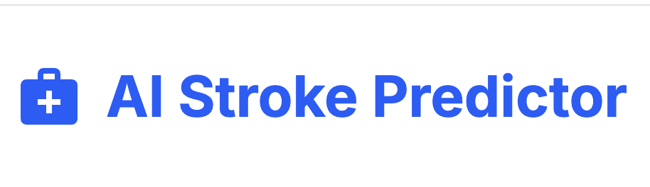
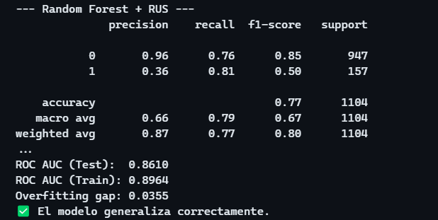
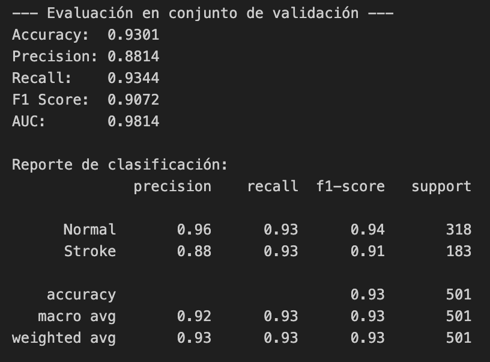
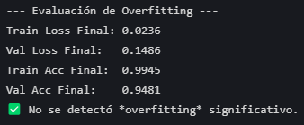
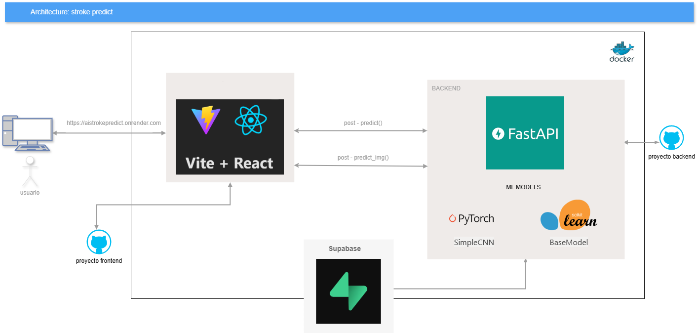
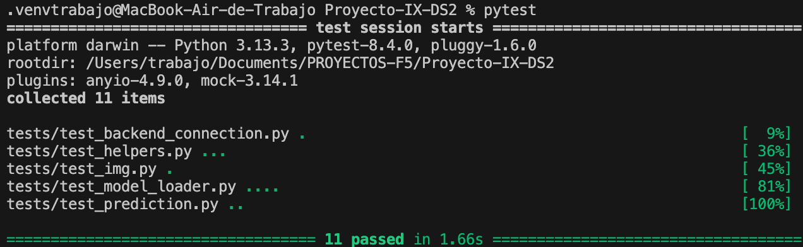

<p align="center">
  
</p>

## 🚀 PROYECTO DATA SCIENTIST/AI DEVELOPER: Aprendizaje Supervisado

Proyecto educativo hecho por:

- [Omar Lengua](https://www.linkedin.com/in/omarlengua/)
- [Max Beltran](https://www.linkedin.com/in/max-beltran/)
- [Cesar Mercado](https://www.linkedin.com/in/cesarmercadohernandez/)
- [Alla Haruty](https://www.linkedin.com/in/allaharuty/)

Este proyecto implementa un modelo de Machine Learning supervisado de clasificación que permite predecir la probabilidad de un accidente cerebrovascular (stroke) a partir de un formulario con datos personales o a partir de una imágenes de resonancia magnética del paciente. 

### ¿Qué dataset utilizamos?

- [Dataset inicial](https://www.kaggle.com/datasets/jillanisofttech/brain-stroke-dataset/data)
- [Dataset secundario para implementar data augmentation y tratamiento de datos desbalanceados](https://data.mendeley.com/datasets/x8ygrw87jw/1)
- [Dataset de imágenes](https://www.kaggle.com/datasets/afridirahman/brain-stroke-ct-image-dataset/data)

Al analizar el dataset inicial notamos un problema importante: los datos estaban fuertemente desbalanceados. Específicamente, había 4.733 casos sin ictus frente a solo 248 con ictus, lo que representa un serio obstáculo para entrenar un modelo fiable.

### ¿Por qué decidimos combinar dos datasets?

Debido al desbalanceo del dataset original, sabíamos que el modelo podría tener dificultades para identificar correctamente los casos positivos (ictus), lo que en un contexto de salud podría tener consecuencias graves. En situaciones como esta, es preferible que el modelo dé falsos positivos antes que falle al detectar un caso real de ictus.

Por eso, decidimos incorporar datos adicionales de un [segundo dataset](https://data.mendeley.com/datasets/x8ygrw87jw/1), asegurándonos de que tuviera al menos las mismas columnas para facilitar la integración. Sin embargo, al combinar ambos conjuntos, el desbalanceo seguía siendo un problema. Para solucionarlo, optamos por añadir únicamente las instancias donde stroke = 1 del segundo dataset, incrementando así el número total de casos positivos.

### Resultado de la combinación

Con esta estrategia pasamos de tener 248 casos positivos a 783 casos de ictus, mejorando significativamente el equilibrio entre clases. Esto nos proporciona una base más sólida para entrenar un modelo con mejor capacidad predictiva, especialmente en la detección de casos positivos.

Para ello, hicimos un análisis exploratorio de datos completo que se puede ver paso a paso en la rama [feature/EDA](https://github.com/alharuty/Proyecto-IX-DS2/tree/feature/EDA) donde cada integrante del equipo estudió y analizó el dataset, y finalmente pudimos verificar y considerar un análisis de datos final que lo llamamos EDA.ipyb .

Para el encontrar el mejor modelo y las mejores métricas, seguimos el mismo paso en la rama [feature/model](https://github.com/alharuty/Proyecto-IX-DS2/tree/feature/model) donde cada integrante estudió y propuso el mejor modelo encontrado. Finalmente elejimos el **modelo RandomForest + RandomUnderSampler** llamado model.pkl hecho por Cesar, con un accuracy de 77%.



Además, como un paso extra y de nivel avanzado, Max pudo entrenar un **modelo de red neuronal (CNN) con PyTorch** llamado cnn_pytorch.pth, para realizar las predicciones mediante las imágenes, con un accuracy del 93% y un overfitting menor que 2%.





Se puede encontrar el entrenamiento final de los 2 modelos en la carpeta model/.

> [!NOET]
> 
> Las ramas feature/model, feature/EDA no se han mergeado completamente en la rama main, sino sólo los archivos necesarios y el informe técnico encontrarás en la carpeta model/.



[Puedes ver un video demo haciendo click aquí](https://github.com/alharuty/Proyecto-IX-DS2/releases/download/video-demo/demo-stroke.mov)

La aplicación está compuesta por un backend desarrollado con FastAPI y un frontend construido con React utilizando Vite como herramienta de construcción. Ambos servicios están dockerizados y sus respectivas imágenes han sido publicadas en Docker Hub, lo que facilita su despliegue en cualquier entorno compatible con Docker.

# ¿Quieres probar la aplicación? Sigue los siguientes pasos

Descarga y entra en el repositorio:

```bash
git clone https://github.com/alharuty/Proyecto-IX-DS2.git
```

```bash
cd Proyecto-IX-DS2
```

## Opción 1: Usando el repositorio

**Paso 1: Descarga los archivos necesarios**

Navega a `https://github.com/alharuty/Proyecto-IX-DS2/releases`, descarga los archivos model.pkl y cnn_pytorch.pth y ubícalos en la carpeta data/.

**Paso 2: Crea un entorno virtual y actívalo**

```bash 
python3 -m venv .venv
```
```bash
source .venv/bin/activate
```

**Paso 3: Descargar las dependencias necesarias**

```bash
pip install -r requirements.txt
```
**Paso 4: Pon en marcha el backend**

```bash
uvicorn fast_api.main:app --reload
```
**Paso 5: Pon en marcha el frontend**

```bash
cd client
```
```bash
npm install
```

```bash
npm run dev
```

**Paso 6: Abre el navegador y prueba la aplicación en la siguiente ruta**

```bash
127.0.0.1:5173
```

## Opción 2: Utiliza el Docker

**Paso 1: Asegúrate de tener el Docker Desktop abierto**

**Paso 2: Pon en marcha el compose.yml**

```bash
docker-compose up --build
```

**Paso 3: Abre el navegador y prueba la aplicación en la siguiente ruta**

```bash
127.0.0.1:5173
```

# Probar test unitarios

Tenemos 11 test divididos en 5 archivos diferentes que comprueban el buen funcionamiento de toda la aplicación. Para probarlo sitúate en la raíz del directorio, activa el entorno vitual y corre el siguiente comando:

```bash
pytest
```




> [!NOTE]
>
> Los tests pasan SOLO si está el backend levantado, ya que uno de ellos comprueba que el backend funcione correctamente. Por lo que usa el comando `uvicorn fast_api.main:app --reload` para levantar el backend antes de correr los tests.


> [!NOTE]
> 
> Además de los tests, hemos integrad logs por todo el backend para tener una trazabilidad de los pasos que se llevan. Estos logs se guardan en logs/logs.log, mostrando la hora, el tipo de nivel y la información sobre esta.

[PowerPoint usado en la presentación del proyecto](https://gamma.app/docs/Uso-de-Tecnologia-para-el-Diagnostico-y-Prediccion-de-Accidentes--b7xpfa4eoug67ql)

[Link a Deepwiki del repositorio](https://deepwiki.com/alharuty/Proyecto-IX-DS2)

Hemos conseguido terminar este proyecto con la metodología scrum y un reparto de roles:
- Alla como Scrum Master y desarrolladora Backend con FastApi
- Omar como desarrollador Frontend con React
- Max como Ingeniero de Datos e Ingeniero de Machine Learning CNN
- Cesar como Ingeniero de Machine Learning RandomForest

Aunque los roles estaban bien definidos, uno de los aspectos más valiosos del proyecto ha sido la colaboración transversal. El análisis de datos ha sido un esfuerzo compartido por todo el equipo, permitiéndonos tener una comprensión profunda del conjunto de datos, identificar variables relevantes, realizar limpieza y preprocesamiento, y definir las estrategias de modelado más adecuadas.